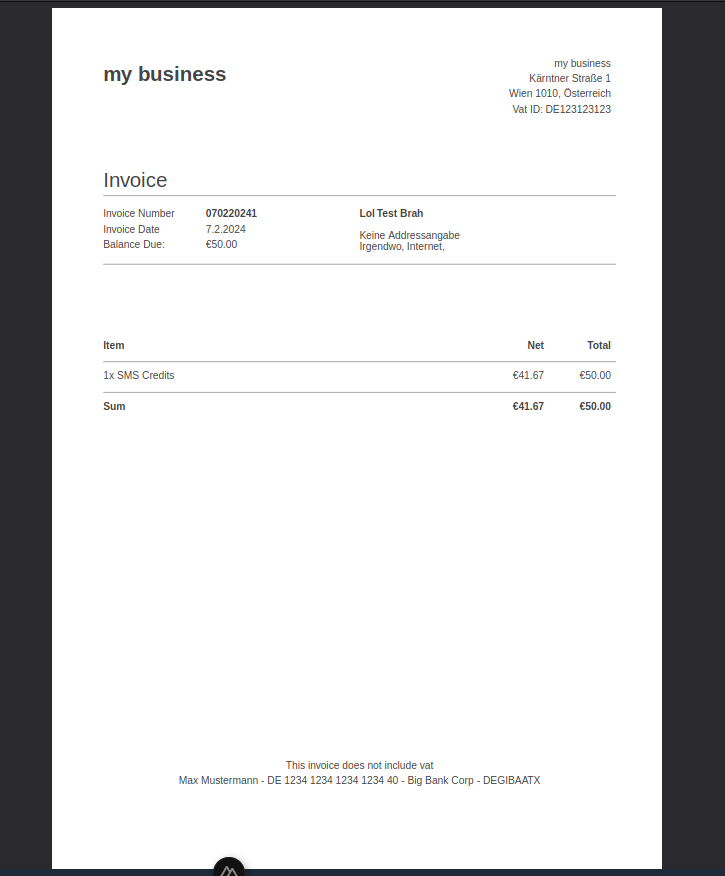

# Invoice.js
Generate Invoices as PDF using Javascript. Super easy code, open source.
It uses pdfkit to generate the invoice, and md5 hashing to combine similar products on the invoice itself.
I wanted to publish this as I was not happy with other invoicing tools on github for javascript.
It is open source. If you contribute to the code, please reach out and give me the improvements, I will incorporate all improvements.

<center>
  
</center>

## Installation & Dependencies
It should be fairly easy to install:
1) Install 2 dependencies
```
npm i md5
npm i pdfkit
```
2) Copy code to your codebase
3) Create instance of Invoice object as follows
```
// example.js
import Invoice from "Invoice.js"; // of course, provide the correct path
const invoice = new Invoice("InvoiceId1", new Date(), new Date(), "vatId", "en");

invoice.setSeller("Main St. 1", "1010", "Vienna", "Austria");
invoice.setBuyer("Main St. 2", "1010", "Vienna", "Austria");
invoice.setCurrency("usd");
invoice.setPaymentInfo("DE12 1234 1234 1234 1234", "My Name", "BICAATWWXXX", "Bank Name");
invoice.addProduct("My product", 100, 0, 100);
const pdf = invoice.generatePDF();
```
4) Display invoice somehow
It's base64 encoded. Either you can change the encoding on the generatePDF() method, or you display it somehow, according to your needs. If you want to display it in html, maybe this can help you:
```
example.html (invalid code, whats important is the content of src attribute)
<iframe src="`data:application/pdf;base64,${pdf}`" title="Invoice PDF generated by Invoice JS" />
```

## More information
I'm using this on the backend (node) but appearently it should work on the browser aswell, according to the pdfkit documentation:
Link to pdfkit: https://pdfkit.org/docs/getting_started.html

## Special thanks
Thanks to pdfkit, @ksafranski for the currencies and @PSPDFKit-labs for some of the code, this was my starting point.
